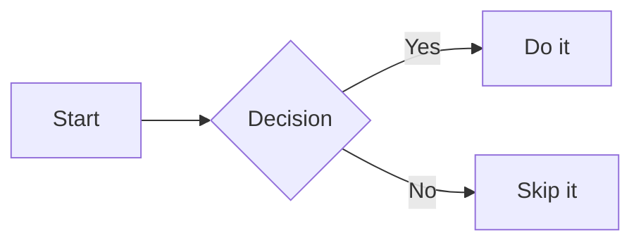

# md Viewer — macOS Markdown Viewer

A clean, native-feeling macOS markdown viewer built with Flutter.

## Features

- Open `.md`, `.markdown`, `.txt`, `.mdown`, `.mkd` files
- Recent files sidebar with timestamps
- Dark / light theme toggle
- Mermaid diagram rendering (flowcharts, sequence diagrams, etc.)
- Clickable links open in your browser
- Reload file to pick up external changes
- Export to **PDF**, **Word (.docx)**, or **Open in Pages**
- Keyboard shortcuts: `⌘O` open, `⌘R` reload, `⌘\` toggle sidebar
- Beautiful typography using Merriweather (body) + JetBrains Mono (code) + Inter (UI)

## Setup

### Prerequisites

- Flutter SDK ≥ 3.0 with macOS desktop support enabled
- Xcode installed

Enable macOS desktop if not already:
```bash
flutter config --enable-macos-desktop
```

### Run

```bash
flutter pub get
flutter run -d macos
```

### Build

```bash
flutter build macos
# Output: build/macos/Build/Products/Release/md Viewer.app
```

### Tests

```bash
flutter test
```

## Project Structure

```
lib/
  main.dart              # Entry point
  app.dart               # App root, theme configuration
  models/
    markdown_file.dart   # File data model
  services/
    export_service.dart  # Export orchestration (save panel, format registry)
    file_service.dart    # File picking, reading, recent files
    mermaid_renderer.dart# Fetches mermaid diagrams as PNG via mermaid.ink
    formats/
      pdf_format.dart    # PDF export (pure-Dart, two-font Unicode support)
      docx_format.dart   # DOCX export (OOXML bundle via archive package)
      pages_format.dart  # Opens exported DOCX in Pages
  utils/
    markdown_splitter.dart  # Splits markdown into mermaid / text segments
  screens/
    home_screen.dart     # Main screen with layout
  widgets/
    title_bar.dart       # Custom macOS-style title bar with export menu
    sidebar.dart         # Recent files sidebar
    markdown_viewer.dart # Styled markdown renderer
    mermaid_block.dart   # Mermaid diagram renderer (WebView + Mermaid.js)
    empty_state.dart     # Empty/welcome state
test/
  models/
    markdown_file_test.dart       # MarkdownFile model tests
  services/
    file_service_test.dart        # FileService tests
  utils/
    markdown_splitter_test.dart   # MarkdownSplitter tests
macos/
  Runner/
    DebugProfile.entitlements     # Sandbox + file access (debug)
    Release.entitlements          # Sandbox + file access (release)
```

## Export

Use the export button in the title bar to save the current file in another format.

| Format | Notes |
|---|---|
| PDF | Full fidelity — headings, tables, code blocks, inline formatting, mermaid diagrams as images |
| Word (.docx) | OOXML bundle compatible with Word, Pages, and LibreOffice |
| Open in Pages | Exports as DOCX to a temp file and opens it in Pages |

PDF export uses Courier New for code and Arial Unicode for symbols and non-Latin characters, so special characters like `⌘`, `⌥`, and `→` render correctly.

## Entitlements

The app uses macOS App Sandbox with `com.apple.security.files.user-selected.read-write` so the file picker and save panel can access user-chosen files. No broad filesystem access is requested.

## Sample Mermaid


